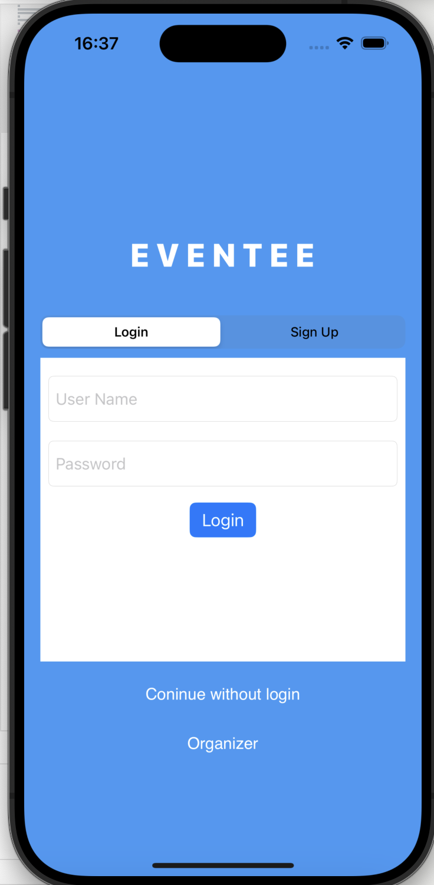
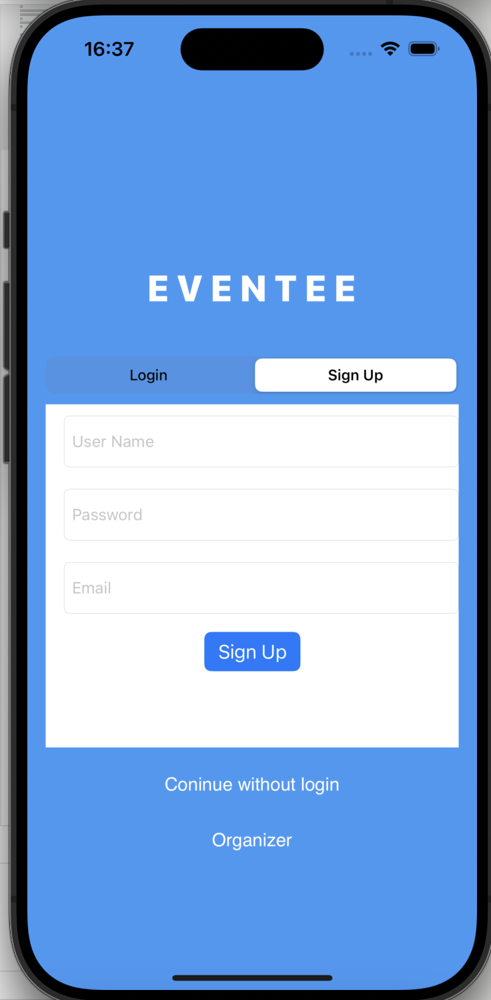

# EventManagmentPlatformPrototype
A prototype project for Event Managment And Ticketing Platform - Eventee 

# Project Overview

## Architecture & Technologies Used
- **MVVM Architecture:** Ensures a clear separation of concerns and enhances maintainability.
- **Firebase:** Provides a robust backend solution for real-time data handling.

## Purpose
This project was developed as a prototype for an Event Management and Ticketing Platform required for a Software Engineering course.

## Focus of the Course
The course primarily focuses on software analysis and design. These phases have been meticulously completed to ensure a comprehensive understanding and application of software engineering principles.

## Implementation Details
Implementation has been conducted for the main use case only, aligning with the course's requirement to demonstrate practical application.

